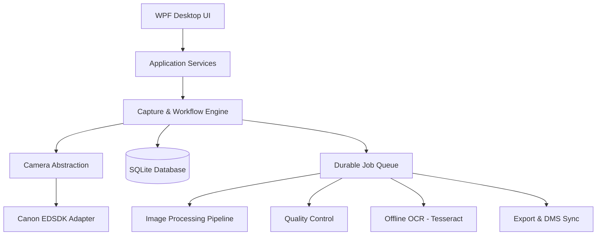

# Architecture

## Overview
The application follows a layered architecture to decouple the UI from the camera integration and background processing tasks.

## Layers
1. **UI Layer**: C# WPF (.NET 8). Handles Live View, thumbnail rendering, operator inputs, and status displays.
2. **Application Services**: Manages projects, batches, profiles, operators, and metadata.
3. **Capture Engine**: Coordinates camera capture, safe storage of original images (zero data loss), and enqueues background jobs.
4. **Camera Abstraction (`ICameraService`)**: Defines standard camera capabilities (Live View, Capture, Download, Settings) without Canon-specific knowledge.
5. **Background Processors**: Asynchronous workers consuming the durable job queue (Image Processing via OpenCvSharp, OCR via Tesseract, DMS Uploads via HTTP/REST).

## Zero-Data-Loss Principle
Camera captures are immediately downloaded, saved to disk, and logged in SQLite. Image processing happens strictly on derivatives. The master file is never automatically deleted.
